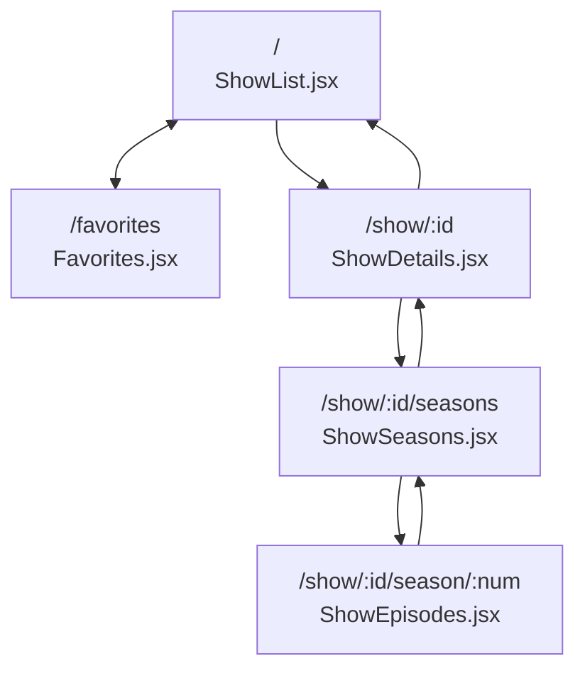

# Mypodspace – Podcast Streaming Web App

## Overview

Mypodspace is a React-powered web application designed for streaming and managing podcast content. It offers users a clean and intuitive interface to discover, explore, and enjoy their favorite podcasts. The app supports both light and dark themes to enhance user comfort.

## How to Use MyListeningPod

MyListeningPod is easy to navigate and use. You can access the live application at:

[MyListeningPod - Live Demo](https://mylisteningpod.netlify.app/)

### Getting Started

1. **Browse Shows**: On the home page, you'll find a list of available podcast shows. Browse through them or use the sorting and filtering options to find shows that interest you.

2. **View Show Details**: Click on any show card to view detailed information about that podcast, including its description and available seasons.

3. **Navigate Seasons**: From the show details page, click on "View Seasons" to see all available seasons for that podcast.

4. **Listen to Episodes**: Select a season to view its episodes. Click on any episode to start playback.

5. **Add to Favorites**: While browsing episodes, click the "Add to Favorites" button to save episodes for later listening.

6. **Access Favorites**: Navigate to the Favorites section to view and play your saved episodes.

7. **Switch Themes**: Toggle between light and dark themes using the theme button in the header.

## Main Features

- **Podcast Discovery**: Browse a curated collection of podcast shows across various genres.
- **Episode Streaming**: Listen to podcast episodes with an integrated audio player.
- **Season Navigation**: Navigate through different seasons of podcast shows.
- **Favorites System**: Save favorite episodes for quick access.
- **Responsive Design**: Optimized for both desktop and mobile devices.
- **Theme Switching**: Toggle between light and dark themes based on user preference.
- **Sorting & Filtering**: Organize podcast shows by title, genre, and date.
- **Playback Continuity**: Continue listening to episodes even when navigating between pages for ease of use.

### Audio Player

The audio player is located at the bottom of the screen and remains accessible as you navigate through the application. It displays the currently playing episode and provides standard playback controls.

## Project Structure

### Application Routes

### Navigation Flow

- **Home** (`/`): Browse all podcast shows
- **Favorites** (`/favorites`): View saved episodes
- **Show Details** (`/show/:id`): View podcast information
- **Seasons** (`/show/:id/seasons`): Browse seasons for a show
- **Episodes** (`/show/:id/season/:num`): View episodes in a season

Users can navigate forward through shows, seasons, and episodes, and then back through the same path. They can also toggle between the home and favorites views.

## Project Requirements

### CORE PROJECT REQUIREMENTS

| CODE  | CATEGORY                           | USER STORIES                                                                                                                                                                                                   | DIFFICULTY | TOTAL | COMPLETED |
| ----- | ---------------------------------- | -------------------------------------------------------------------------------------------------------------------------------------------------------------------------------------------------------------- | ---------- | ----- | --------- |
| P3.1  | Setup and Deployment               | Project is deployed to a custom Netlify URL                                                                                                                                                                    | Medium     | 2     | ✅        |
| P3.2  |                                    | User sees a custom icon in the tab window. All favicon information has been created an added correctly via realfavicongenerator.net                                                                            | Easy       | 1     | ✅        |
| P3.3  |                                    | Metatag information has been created and added via metatags.io. Be mindful to manually replace all URL values (especially image URL) to absolute Netlify URL values (you will need to deploy to Netlify first) | Easy       | 1     | ✅        |
| P3.4  | UI/UX                              | User sees the name of all available shows on the platform                                                                                                                                                      | Easy       | 1     | ✅        |
| P3.5  |                                    | User sees shows sorted alphabetically when the app loads (default sorting)                                                                                                                                     | Hard       | 3     | ✅        |
| P3.6  |                                    | User has a way to listen to any episode in a season for a show (note there is a single placeholder audio track for all shows)                                                                                  | Medium     | 2     | ✅        |
| P3.7  |                                    | User is able to see a view where only episodes for a specific selected season are shown (Note that this can be a page view, a modal, or toggle dropdown - up to developer's design choice)                     | Medium     | 2     | ✅        |
| P3.8  |                                    | User is able to toggle between different seasons for the same show                                                                                                                                             | Hard       | 3     | ✅        |
| P3.9  |                                    | User sees preview image of shows when browsing                                                                                                                                                                 | Easy       | 1     | ✅        |
| P3.10 |                                    | User sees the amount of seasons as a number in a show when browsing                                                                                                                                            | Easy       | 1     | ✅        |
| P3.11 |                                    | User sees a human-readable date to when a show was last updated                                                                                                                                                | Easy       | 1     | ✅        |
| P3.12 |                                    | User sees what genres (as genre titles) a show is associated with when browsing                                                                                                                                | Medium     | 2     | ✅        |
| P3.13 |                                    | User sees a preview image of seasons for a specific show (Note some Shows have different images for each Season)                                                                                               | Easy       | 1     | ✅        |
| P3.14 |                                    | User sees the amount of episodes as a number for a season                                                                                                                                                      | Easy       | 1     | ✅        |
| P3.15 |                                    | User is able to go back to a show view from a season-specific view                                                                                                                                             | Easy       | 1     | ✅        |
| P3.16 | Data Fetching and State Management | All show data loaded via a fetch call from the API (Note no podcast data should be hardcoded in the application)                                                                                               | Medium     | 2     | ❌        |
| P3.17 |                                    | When viewing a specific show, data is loaded via fetch from individual show endpoint                                                                                                                           | Medium     | 2     | ✅        |
| P3.18 |                                    | There is a loading state while initial data is being loaded                                                                                                                                                    | Medium     | 2     | ✅        |
| P3.19 |                                    | There is a loading state while new data is being loaded                                                                                                                                                        | Hard       | 3     | ✅        |
| P3.20 | User Interaction                   | User is able to mark specific episodes as favourites so that they can find them again (Note the requirement is that a specific episode of a specific season of a specific show is to be favourited)            | Hard       | 3     | ✅        |
| P3.21 |                                    | User can visit a view where they see all their favourite episode                                                                                                                                               | Hard       | 3     | ✅        |
| P3.22 |                                    | User is able to see the associated show and season when an episode is in favourites                                                                                                                            | Hard       | 3     | ✅        |
| P3.23 |                                    | Related by season/show episodes are grouped together in favourites                                                                                                                                             | Hard       | 3     | ❌        |
| P3.24 |                                    | User is able to remove episodes from their favourites                                                                                                                                                          | Medium     | 2     | ✅        |
| P3.25 |                                    | User sees the date and time that they added something as a favourite                                                                                                                                           | Medium     | 2     | ✅        |
| P3.26 |                                    | User is able to arrange favourites based on title from A-Z                                                                                                                                                     | Medium     | 2     | ✅        |
| P3.27 |                                    | User is able to arrange favourites based on title from Z-A                                                                                                                                                     | Medium     | 2     | ✅        |
| P3.28 |                                    | User is able to arrange favourites starting with the most recently updated                                                                                                                                     | Medium     | 2     | ✅        |
| P3.29 |                                    | User is able to arrange favourites starting with the furthest back updated                                                                                                                                     | Medium     | 2     | ✅        |
| P3.30 |                                    | User is able to arrange lists of shows based on title from A-Z                                                                                                                                                 | Medium     | 2     | ✅        |
| P3.31 |                                    | User is able to arrange lists of shows based on title from Z-A                                                                                                                                                 | Medium     | 2     | ✅        |
| P3.32 |                                    | User is able to arrange list showing the most recently updated (Newly updated Shows)                                                                                                                           | Medium     | 2     | ✅        |
| P3.33 |                                    | User is able to arrange list of shows from least recently updated (Oldest updated Shows)                                                                                                                       | Medium     | 2     | ✅        |
| P3.34 |                                    | Audio player is always visible so that user can listen to episodes while browsing                                                                                                                              | Medium     | 2     | ✅        |
| P3.35 |                                    | Audio player must show listening progress                                                                                                                                                                      | Medium     | 2     | ✅        |
| P3.36 |                                    | User receives a notification that confirms they want to close the page when audio is playing                                                                                                                   | Medium     | 2     | ✅        |
| P3.37 |                                    | User can filter shows by genre                                                                                                                                                                                 | Hard       | 3     | ✅        |
| P3.38 | Persistence and Storage            | App remembers and shows what episodes user listened to all the way through.                                                                                                                                    | Hard       | 3     | ❌        |
| P3.39 |                                    | Favourites must be persisted in localStorage                                                                                                                                                                   | Hard       | 3     | ✅        |
| P3.40 |                                    | User has the option to "reset" all their progress, effectively removing their entire listening history. (Note marks are awarded only for "resetting" entire listening history)                                 | Hard       | 3     | ❌        |
| P3.41 | Overall Assessment                 | The project has a good appearance and Desktop layout when opened in a web browser.                                                                                                                             | Easy       | 3     | ✅        |
| P3.42 |                                    | The project is easy to navigate and interact with through a web browser.                                                                                                                                       | Easy       | 3     | ✅        |
| P3.43 |                                    | The project's commit history shows short and clear commit messages.                                                                                                                                            | Easy       | 3     | ✅        |
| P3.44 |                                    | The project displays well on different devices and all screen sizes, ensuring usability on tablets                                                                                                             | Hard       | 4     | ❌        |
| P3.45 |                                    | The README file includes a comprehensive introduction to the project, setup instructions, usage examples, and contact information.                                                                             | Easy       | 3     | ✅        |
| P3.46 |                                    | The project loads and functions without ANY bugs (Completed user stories possess no bugs whatsoever)                                                                                                           | Hard       | 4     | --        |
| P3.47 |                                    | Well organized project structure & clean readable code                                                                                                                                                         | Medium     | 3     | ✅        |

# STRETCH GOALS 💪

| CODE  | CATEGORY            | USER STORIES                                                                                                | DIFFICULTY | TOTAL | COMPLETED |
| ----- | ------------------- | ----------------------------------------------------------------------------------------------------------- | ---------- | ----- | --------- |
| P3.48 | Additional Features | The project has extra features that make for a good user-experience                                         | Hard       | 3     | ✅        |
| P3.49 |                     | User is presented with a sliding carousel of possible shows they might be interested in on the landing page | Hard       | 3     | ❌        |
| P3.50 |                     | User is able to filter shows based on title by means of a text input                                        | Hard       | 3     | ❌        |
| P3.51 |                     | User is able to find shows based on fuzzy matching of concepts                                              | Hard       | 3     | ❌        |
| P3.52 |                     | App displays the exact timestamp location of where they left off any episode                                | Hard       | 3     | ❌        |

## Struggles

| Requirement | Feature           | Notes                                                                                                                                                                                                                                                                                                                                                                                                                                                                                                                           |
| ----------- | ----------------- | ------------------------------------------------------------------------------------------------------------------------------------------------------------------------------------------------------------------------------------------------------------------------------------------------------------------------------------------------------------------------------------------------------------------------------------------------------------------------------------------------------------------------------- |
| 3.5         | Sorting feature   | The component highlighted the props passed in and I installed a dependency PropTypes from React. This allowed me to specify the props for the button component. The component functioned without this but I added it so that the red error lines would go away. This also makes this component reusable and checks that it only takes those types of props - can help prevent errors.                                                                                                                                           |
|             | React Router      | Really struggled to get react router to function properly because I did not implement it from the start. There was a lot to change all at once and i had a hard time with finding/understanding the bugs. I had to change the way children components got data via useParamas rather than using props. This took me ages to figure out.                                                                                                                                                                                         |
| 3.20 & 3.39 | Favorites         | The setFavorites functionality was very hard to implement. I had to create a unique id so that i could compare it to existing episode ids, in order to know if something is already added to localstorage or not losts of bugs and trouble shooting. The unique ids also serves the to prevent clashing data if there are episodes with same names accross different seasons and shows.                                                                                                                                         |
| 3.23        | Favorite Grouping | Could not make it so favorite episodes are grouped by season/show episodes                                                                                                                                                                                                                                                                                                                                                                                                                                                      |
|             | Audio Player      | I can get the audio player to play the episode clicked on but struggling to reset it when a different episode is clicked. I didnt want to create a store or a bigger context state because I dont really have the confidence so I had to drill props to make the audio player work. For now the user can click an episode the handleEpisodePLay is called in the SHowEpisodes and it passes the data up the the App parent where currentEpisode state changes and its then passed to the MusicPLayer component that handles it. |
|             | Audio Player      | Im having difficulty resetting the audio player when moving to a new episode. Right now the new episode is playing but it continues where the other left off (problem is likely due to the auidio file being the same)                                                                                                                                                                                                                                                                                                          |
| All others  |                   | No time and complexity was too hard to implement                                                                                                                                                                                                                                                                                                                                                                                                                                                                                |

